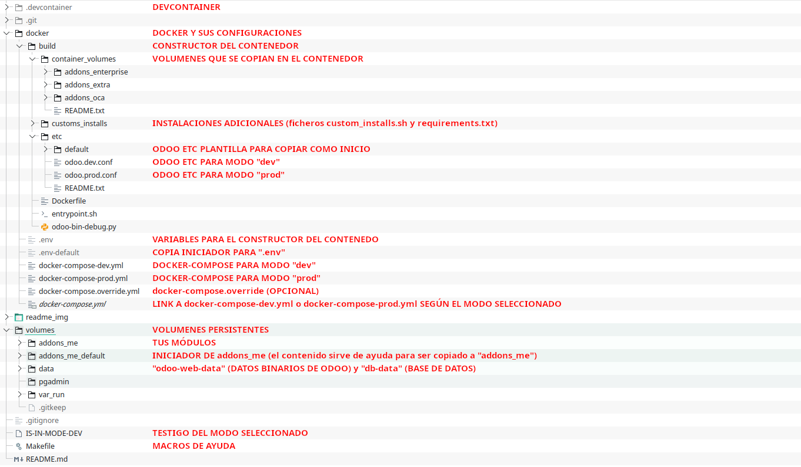
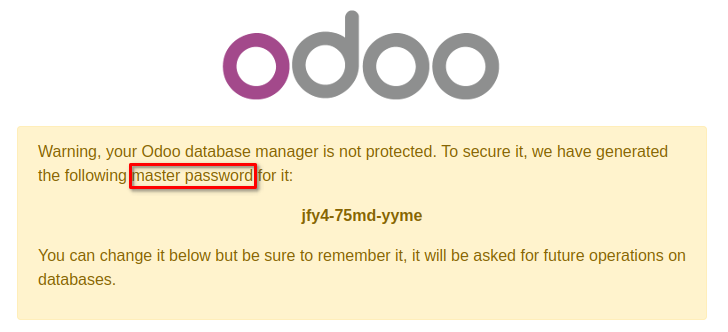
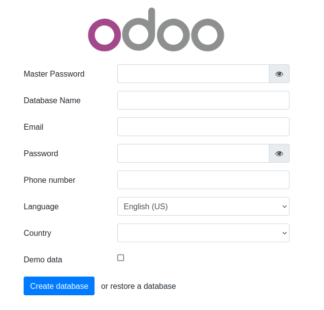
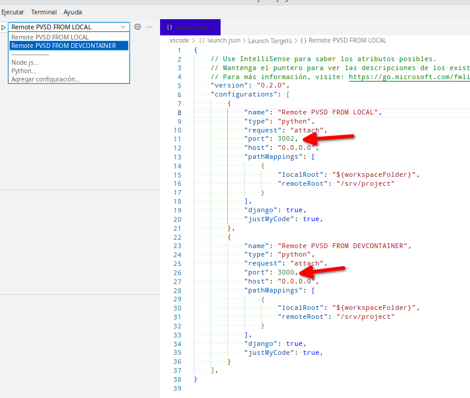
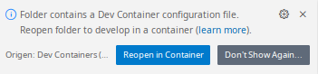
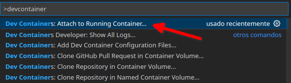
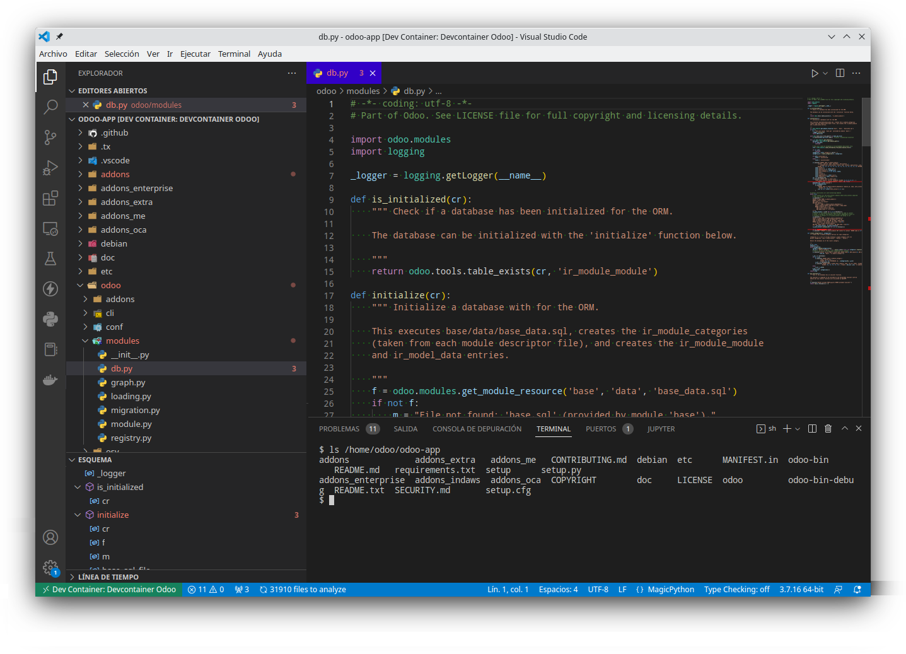

### ¿Que es este repositorio?

Este repositorio te permitirá desplegar **Odoo** es una suite de aplicaciones de gestión empresarial que incluye una gama de herramientas de fácil uso para optimizar y rentabilizar los negocios. Su objetivo es englobar en un único software todas las herramientas que necesita una empresa para la operativa en todos los principales departamentos. En este sentido, Odoo nos ofrece funcionalidades que podrían encajar tanto en un software ERP como en un software CRM.


# Docker compose para Odoo (Desarrollo y Producción)


## Características

Características para el entorno Docker:

- Versión de odoo seleccionable en fichero .env
- Versión de postgresql en fichero .env
- Cambio automático entre DEV/PROD desde comando Makefile
- docker-compose  independiente para los modos Dev/Prod
- Instalaciones adicionales desde docker/build/customs_installs/customs_installs.sh y docker/build/customs_installs/requirements.txt
- Entrada rápida a bash del contenedor Odoo y Odoo-shell (desde Makefile)
- Ptvsd activable desde fichero .env
- ~~Jupyter~~ (pendiente)
- DevContainer
  

## ¿Por que Odoo en Docker?

Porque Docker nos permite una gran movilidad, simpliciad, y rapidez en el despliegue de nuestros proyectos en cualquier servidor.<br>
También nos simplifica el hacer un backup de todo el entorno, o clonarlo en cualquier lugar (Proyecto, configuración, base de datos, y todo el entorno completo)


## Presentación

Este diseño facilita la rápida conmutación entre los modos **DEV** y **PROD**, personalizando el entorno y la configuración de Odoo.<br>

El comando que se ejecuta en consola desde la raiz del proyecto,  **make dev** y **make prod**, conmutan estos 2 modos sin necesidad de recompilar la imagen.<br>
En esta conmutación automática se crean el enlace .docker-compose.yml que apunta a los ficheros docker-compose-dev.yml o docker-compose-prod.yml según el modo seleccionado.<br>
Y al mismo tiempo se genera un link, **IS-IN-MODE-DEV** o **IS-IN-MODE-PROD**, para dejar como testigo visual cual es el modo seleccionado actual.<br>

Según el modo seleccionado (con make dev o make prod), odoo usará una configuración u otra.
Siendo la variable "debug" una de las diferencias entre los 2 modos.

Ejemplo




## Iniciar proyecto

### Configurar el entorno🔧

Creamos o editamos los ficheros para instalaciones adicionales:

- docker/build/customs_installs/customs_installs.sh
  - insertamos lineas de apt-get (ejemplo: apt-get install git)
  - insertamos lineas de pip o pip3 install
  
- docker/build/customs_installs/requirements.txt (con el formato conocido del requirements usado por python)

*Estos ficheros están en .gitignore para que el repositorio no lo recoga los cambios producidos por el usuario, ya que estos determinan la configuración local del proyecto del usuario.*<br>
*Así que cuando hagamos un "git pull" a este repositorio, no habrá problemas ni conflictos por los cambios en este fichero.*


#### Entorno Docker (fichero .env)

Abrimos el fichero **docker/.env** (si no existe, lo copiamos de **docker/.env.default**)

Y lo configuramos:

```
COMPOSE_PROJECT_NAME=odoo-hiveagile-dev
CONTAINER_NAME=odoo-hiveagile-dev
ODOO_HOSTNAME=odoo.hiveagile.dev
ODOO_TRAEFIK_HOSTNAME=odoo.hiveagile.dev

# ODOO_LOG_MODE: El nivel de log de odoo, y que por defecto va a mostrar por consola
# puede ser -> 'info', 'debug_rpc', 'warn', 'test', 'critical', 'debug_sql', 'error', 'debug', 'debug_rpc_answer', 'notset'
ODOO_LOG_MODE=error

# DEBUG_PTVSD: [0|1] Define si PTVSD va a estar a la escucha
DEBUG_PTVSD=0

# Versión de Odoo
ODOO_VERSION=14.0

# Versión de postgres
POSTGRES_VERSION=12

# Acceso a base de datos de postgres
DB_USER=odoo
DB_NAME=postgres
DB_PASSWORD=odoo

# Puertos publicos
EXPOSE_PUBLIC_PORT_ODOO=6069
EXPOSE_PUBLIC_PORT_DB=6432
EXPOSE_PUBLIC_PORT_DEBUG=3001

```


Si el fichero .env no existe, el make nos dará este error

```
Makefile:3: docker/.env: No existe el fichero o el directorio 
make: *** No hay ninguna regla para construir el objetivo 'docker/.env'.  Alto.
```


Si el link docker-compose.yml no existe, también recibiremos el mismo error
Entonces tendremos que seleccionar el modo (make dev ó make prod)

#### Preparar odoo.conf

Si es la primera vez que usamos este proyecto docker
Si es la copia de otro proyecto pero queremos reinicializar su configuración

```
make config_reset
```

y editamos los ficheros:

- docker/build/etc/odoo.dev.conf
- docker/build/etc/odoo.prod.conf
- docker/.env

Al editar los 2 primeros, es necesario recrear la compilación de docker (make up_build)

Si alguno de estos ficheros no existen, veremos en consola avisos como este:

```
| ************************************************************************** 
| No existe el fichero etc/odoo.dev.conf en el contenedor 
| Comprueba que existe docker/build/etc/odoo.dev.conf 
| Existe una copia de inciación en docker/build/etc/default/odoo.dev.conf 
| **************************************************************************
```


#### Preparar addons_me (addons_me_default)

La carpeta volumes/addons_me_default es un referente para aplicar cosas a tu carpeta "addons_me".<br>
Copia de esta carpeta "addons_me_default" lo que te interese aplicar a "addons_me".<br>
Por defecto tenemos la carpeta ".vscode":

- **.vscode**<br>
  - Contiene
    - extensions.json: <br>La recomendación de aplicaciones a instalar. (Visual Code te ofrecerá la respectiva sugerencia)
    - launch.json:<br> 2 modos de debug:
      - Debug para el proyecto cargado como carpeta
      - Debug para el proyecto cargado como devcontainer
    - settings.json:<br>Configuración de Visual Code, entre ellos la configuración de Flake8


#### Arrancar docker con odoo configurado

Simplemente en consola, escribimos:

```
make dev
```

ó

```
make prod
```

ó si ya tienes un modo seleccionado:

```
make up
```


Nos podría aparecer el siguiente mensaje:

```
Makefile:3: docker/.env: No existe el fichero o el directorio 
make: *** No hay ninguna regla para construir el objetivo 'docker/.env'.  Alto.
```

Esto será debido a que:

- Falta el fichero **docker/.env** (tenemos una copia en docker/.env-default_env)
- Falta el link **docker/docker-compose.yml** (lo genera **make dev** o **make prod**)


Si todo va bien, veremos en consola algo así:

```
| ************************************************************* 
| CONTAINER-NAME: my-odoo
| HOST: odoo-db 
| PORT: 5432 
| USER: odoo 
| PASSWORD: odoo 
| Using odoo conf: /home/odoo/odoo-app/etc/odoo.conf 
| LISTENINT IN PUBLIC PORT: 6069 
| *************************************************************
```


Si en el navegador nos aparece:



Se debe a que no hemos generado el fichero **docker/build/etc/odoo.dev.conf** o **docker/build/etc/odoo.prod.conf** (tenemos una copia de ambos en **docker/build/etc/default**)


## Comandos make

El comando make nos sirve para ahorrarnos un montón de comandos de uso frecuente.

- dev
  cambia los links a modo dev
  *Sintaxis: make dev*

- prod
  cambia los links a modo prod
  *Sintaxis: make prod*

- start:
  Ejecuta docker-compose start
  *Sintaxis: make start*

- stop:
  Ejecuta docker-compose stop
  *Sintaxis: make stop*

- up:
  Ejecuta docker-compose up
  *Sintaxis: make up*

- up_build:
  Ejecuta docker-compose build & docker-compose up
  *Sintaxis: make up_build*
	@cd docker && docker-compose -f docker-compose.yml up

- down:
  Ejecuta docker-compose down
  *Sintaxis: make down*

- log:
  Ejecuta docker-compose log
  *Sintaxis: make log*

- ps:
  Ejecuta docker-compose ps
  *Sintaxis: make ps*

- fix_folders_permissions: ## Arreglar permisos en carpetas
	@sudo chmod -R 777 ./volumes/data/odoo-web-data
	@docker exec -u root -ti ${CONTAINER_NAME} chown -R odoo:odoo /home/odoo/odoo-web-data

- config_show:
  Mostrar configuración. fichero '.env'(Docker) y fichero 'odoo.conf'(Contenedor)
  *Sintaxis: make config_show*

- config_reset:
  Resetear configuración. fichero '.env'(Docker) y fichero 'odoo.conf'(Contenedor)
  *Sintaxis: make config_reset*

- config_remove:
  Eliminar configuración. fichero '.env'(Docker) y fichero 'odoo.conf'(Contenedor)
  *Sintaxis: make config_remove*

- volume_dbs_backup:
  Backup del contenido de la carpeta postgresql
  *Sintaxis: make dbs_backup*

- container_odoo_bash:
  Bash en contenedor odoo
	*Sintaxis: @docker exec -u odoo -ti ${CONTAINER_NAME} bash*

- container_odoo_bash_root:
  Bash en contenedor odoo as root user
	*Sintaxis: @docker exec -u root -ti ${CONTAINER_NAME} bash*

- container_odoo_shell:
  Entrar en el shell de odoo(Container como user odoo)
  *Sintaxis: make container_odoo_shell db={database}*

- container_odoo_update_module:
  odoo actualizar 1 modulo.
  *Sintaxis: make container_odoo_update_module db={database} module={nombre}*

- container_odoo_update_all_modules:
  odoo actualizar todos los módulos.
  *Sintaxis: make container_odoo_update_module db={database}*

- container_odoo_scaffold:
  odoo crear nuevo modulo.
  *Sintaxis: make container_odoo_scaffold modulo={modulo}*

- container_psql_bash:
  Bash del contenedor postgresql
  *Sintaxis: make container_psql_bash*

- container_psql_shell:
  Entrar en el shell postgresql (Container como user postgres)
  *Sintaxis: make container_psql_shell*

- container_psql_db_create:
  Crea base de datos en psql
  *Sintaxis: make container_psql_db_create db={database}*

- container_psql_db_remove:
  Elimina base de datos en psql
  *Sintaxis: make container_psql_db_remove db={database}*

- container_psql_import:
  Importa fichero /volumes/data/db-data/import_dump.sql a la base de datos {db} de postgresql
  *Sintaxis: make container_psql_import db={database}*

- container_psql_export:
  Exporta base de datos {db} de postgresql a fichero /volumes/data/db-data/export_dump.sql
  *Sintaxis: make container_psql_import db={database}*


## Probar Odoo

Tras levantar el contenedor de docker con **make dev**/**made prod** o  **make up**<br>

Introducimos en el navegador http://locahost:6069 (o el puerto que hayamos seleccionado)<br>

Página por defecto de Odoo




## Reiniciar la base de datos

1. make down (Parar la instancia del contenedor)
2. rm -R volumes/data (Borrar el contenido del volumen db-data y odoo-web-data)
3. make up (Volvemos a levantar el contenedor de docker)

Y la base de datos vuelve a crearse de nuevo.<br>


## Debug

El debug está activado por defecto en el modo "dev" y desactivado en el modo "prod"

Para cambiarlo, modificar el fichero correspondiente en **docker/build/etc**


## Debug con Ptvsd

Aplicable sólo en el modo "dev".

Para modificarlo, editar el fichero **docker/.env**:

```
DEBUG_PTVSD=True
```

Y reiniciamos el contenedor. (make down y make up)

Y en Visual Code seleccionamos el debuger que nos interesa (foto siguiente)  con el puerto especificado.<br>
Se entiende que remoteRoot (la ruta en el contenedor) es /srv/project, debiendose cambiar si tu proyecto en el contenedor difiere de esta ruta.



Acto seguido y como es popularmente sabido, marcamos los puntos de interrupción en los ficheros, y hacemos click en el icono "play" del debug.


## Jupyter (pendiente)


## Visual Code

Hay 2 formas de abrir el código de Odoo 

### Abrir el proyecto como carpeta.

Abrimos con Visual Code la carpeta volumes/addons_me.<br>
Desde esta carpeta programaremos sobre nuestros módulos.<br>
Y sobre esta carpeta Visual Code leerá la carpeta .vscode, donde aplicará, configuraciones, configuración del debug, recomendaciones sobre una lista predefinida de complementos de Visual Code.<br>
(si la carpeta .vscode no existe, encontraremos un ejemplar en volumes/django_default)


### Abrir el proyecto como Devcontainer

Para poder usar Devcontainer, es necesario instalar previamente el complemento: **ms-vscode-remote.remote-containers**<br>

El constructor del contenedor copia el volumes/addons_me/.vscode al entorno Devcontainer.<br>
Recuerda  **volumes/addons_me/.vscode => /home/odoo/odoo_app/.vscode (Devcontainer)**<br>
y .devcontainer/devcontainer.json también tiene su propio settings, siendo el resultado final la mezcla de ambos.

Para abrir el proyecto con Devcontainer hay 3 formas de hacer:

- #### Desde visual code

  Abrimos con Visual Code la carpeta raíz del proyecto (justo el nivel superior donde se encuentra la carpeta **.devcontainer**) .<br>Nos tiene que aparece el siguiente diálogo el cual haremos click en "Reopen in Container"
  

- #### Desde el navegador de ficheros

  Con el típico abrir con... y abriendo la carpeta raíz del proyecto.<br>
  Y mismo caso que antes
  

- #### Desde visual code y el complemento Devcontainer

  Previamente levantamos el contendor (make up)<br>
  Abrimos Visual Code<br>
  Presionamos Ctrl+Shift+P (o F1) y escribimos "devcontainer"

  

  Seleccionamos "Attach to Running Container"
  A continuación se abre una lista con los contenedores que están funcionando en el sistema, y seleccionamos el servicio que corresponde a nuestro contenedor.

Haciendo esto, estaremos abriendo con Visual Code un entorno especial donde encontraremos, todos los ficheros del contenedor a disposición del IDE como si se tratasen de ficheros locales, debug, complementos, configuraciones varias.<br>

Devcontainer es una nueva tecnología de Visual Studio Code que ofrece este modo de trabajo tan interesante.<br>

Para el conocimiento de Devcontainer => https://code.visualstudio.com/docs/devcontainers/containers<br>

El devcontainer configurado en este proyecto es muy básico y simplificado, que nada tiene que ver con las posibilidades que ofrece esta tecnología.<br>

Ejemplo de Devcontainer cargado:



### Como funciona internamente Devcontainer

Cuando Visual Studio Code se abre en modo 'devcontainer', hace lo siguiente<br>

- Se conecta al contenedor de Odoo, y la gestion de ficheros y la terminal se ejecuta desde dentro del contenedor, ofreciéndonos los recursos del mismo como si estuviesen en local.<br>
  De hecho, si hacemos un "abrir fichero", no podremos abrir ficheros locales, las rutas mostradas son las del contenedor.
- El devcontainer aplica a nuestro Visual Studio Code las configuraciones visuales y funcionales indicadas en el fichero devcontainer.json
- El devcontainer va a instalar todas las extensiones a nuestro Visual Studio Code (ojo, no son recomendaciones como en un extensions.json, serán instalaciones explicitas)

En conjunto, devcontainer nos ofrece un entorno completo tal como se define en devcontainer.json.<br>

Y el resultado final es como si alguien te estuviese prestando su entorno de trabajo, tal como lo está usando en su día a día.

## USO
Este docker funciona de una forma diferente para que funcione debes ejecutar los siguientes comandos:

```
cd /root/containers/odoo
make prod
make up
```
Si encuentras mensajes de error que se refieren a problemas de permisos, detener el Docker y ejecutar:

```
make fix_folders_permissions
make up
```


### Master password

La master password por defecto es: `ifq5mLGCBM5dt87`


## Actualizaciones automáticas (Opcional)

Puedes usar watchtower que actualiza todos los contenedores que estan como latest

Esto es algo que pongo en todas las aplicaciones pero no hace falta que se instale cada vez.

```
docker run -d \
    --name watchtower \
    -v /var/run/docker.sock:/var/run/docker.sock \
    containrrr/watchtower -i 30
```


